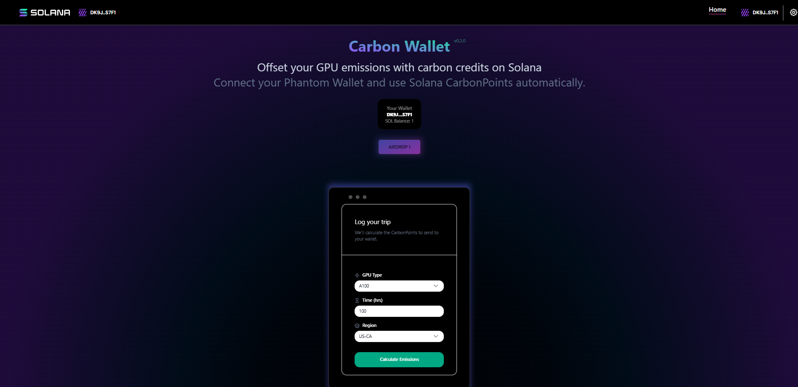

# 🌿 Solana Carbon Wallet

A full-stack web application built with **Next.js** and **Solana Web3.js** that allows users to interact with the Solana blockchain in a sustainable and educational way.

---

## 📸 Demo & Preview

### 🎥 Demo Video
_Add your demo video link here (e.g., YouTube, Loom, or GitHub asset)._

### 🖼️ Screenshot


---

## 🚀 Project Overview

This project is divided into two main parts:

- **Backend** — Node.js services for blockchain interactions and API logic  
- **Frontend** — Next.js application for the user interface, wallet connection, and Solana integration  

---

## 🧩 Prerequisites

Before you begin, ensure you have the following installed:

- [Node.js](https://nodejs.org/) (v18 or newer)
- [Yarn](https://yarnpkg.com/) or npm
- [Git](https://git-scm.com/)
- A supported [Solana Wallet](https://solana.com/wallets) such as Phantom or Solflare

---

## 🧱 Cloning the Repository

```bash
# Clone the repository
git clone https://github.com/tbetti/solana-carbon-wallet.git

# Move into the project folder
cd solana-carbon-wallet
```
---

## ⚙️ Installation & Getting Started
### Backend Setup
```bash
cd backend
npm install
```

### Backend Run the Server
```bash
npm start
```

### Frontend Setup
```bash
cd frontend
npm install
# or
yarn install
```

### Frontend Build
```bash
npm run dev
# or
yarn dev
```

## 🧾 Folder Structure
```bash
solana-carbon-wallet/
├── backend/         # Node.js server and blockchain interaction logic
├── frontend/        # Next.js app for UI and wallet interaction
├── .gitignore
├── README.md
└── package.json
```

## 🧪 Troubleshooting
If you encounter dependency or build errors, within both the front- and backend directories:
```bash
# Clean the installation
rm -rf node_modules
rm package-lock.json # or yarn.lock
npm install
```
If Next.js fails to build due to incompatible SWC binaries (Windows issue), ensure all modules are properly deleted before reinstalling.

## 🪙 License
This project is licensed under the Apache and MIT License — see the LICENSE
file for details.

## 🌐 Resources

Next.js Documentation

Solana Docs

Solana Cookbook
